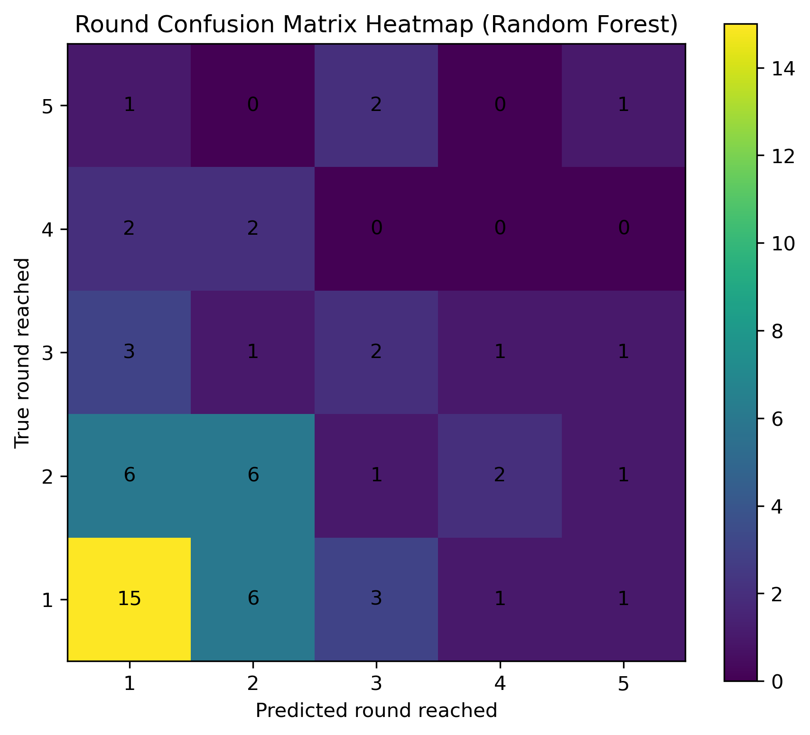
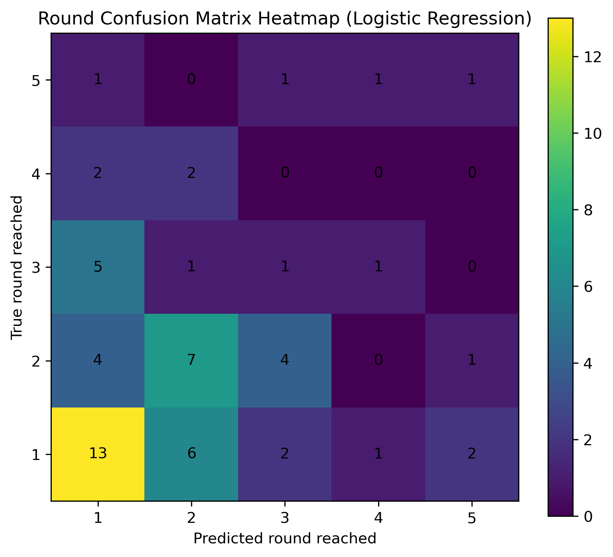
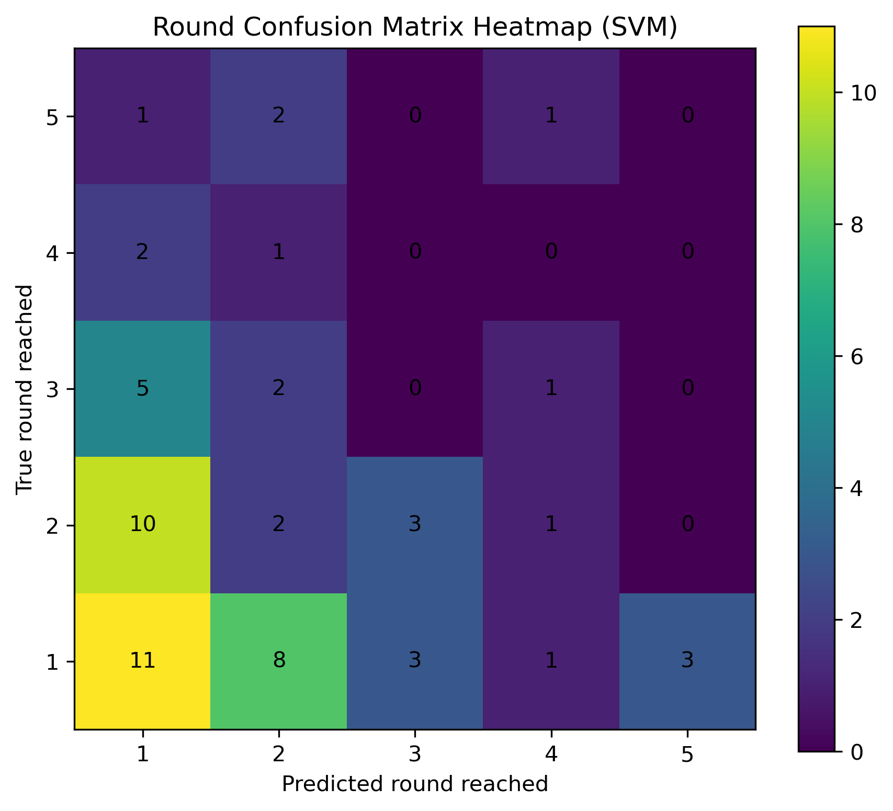
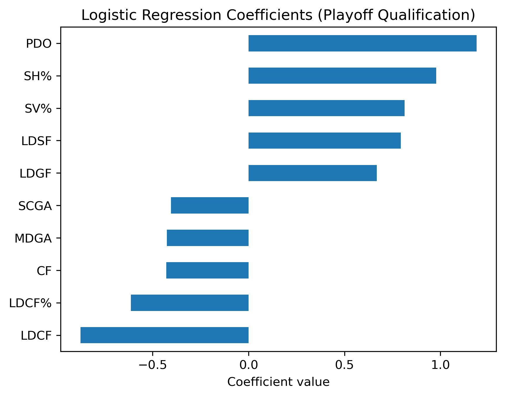
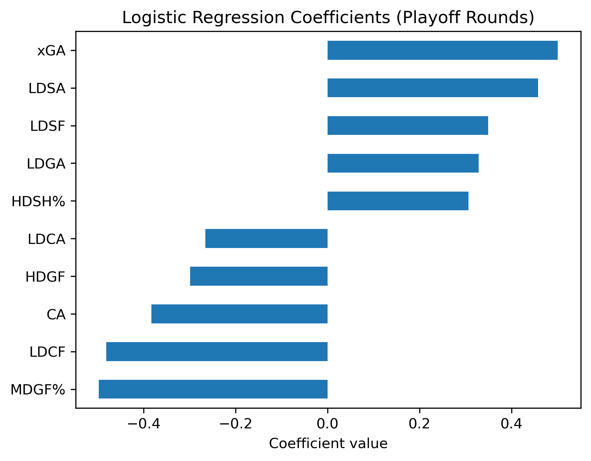
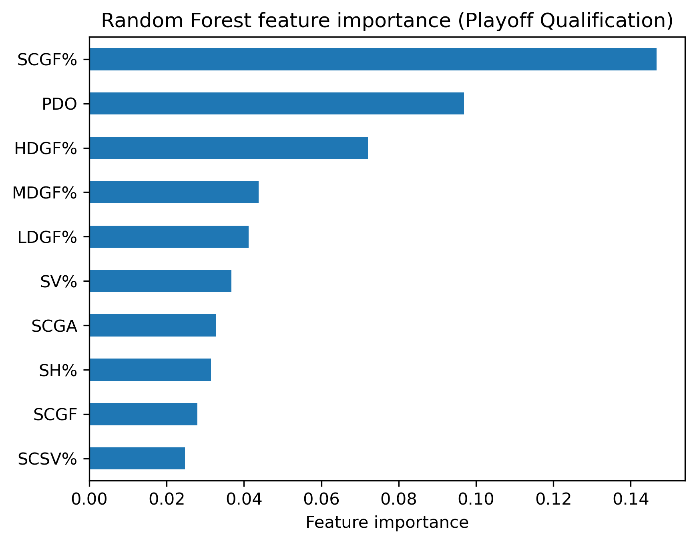
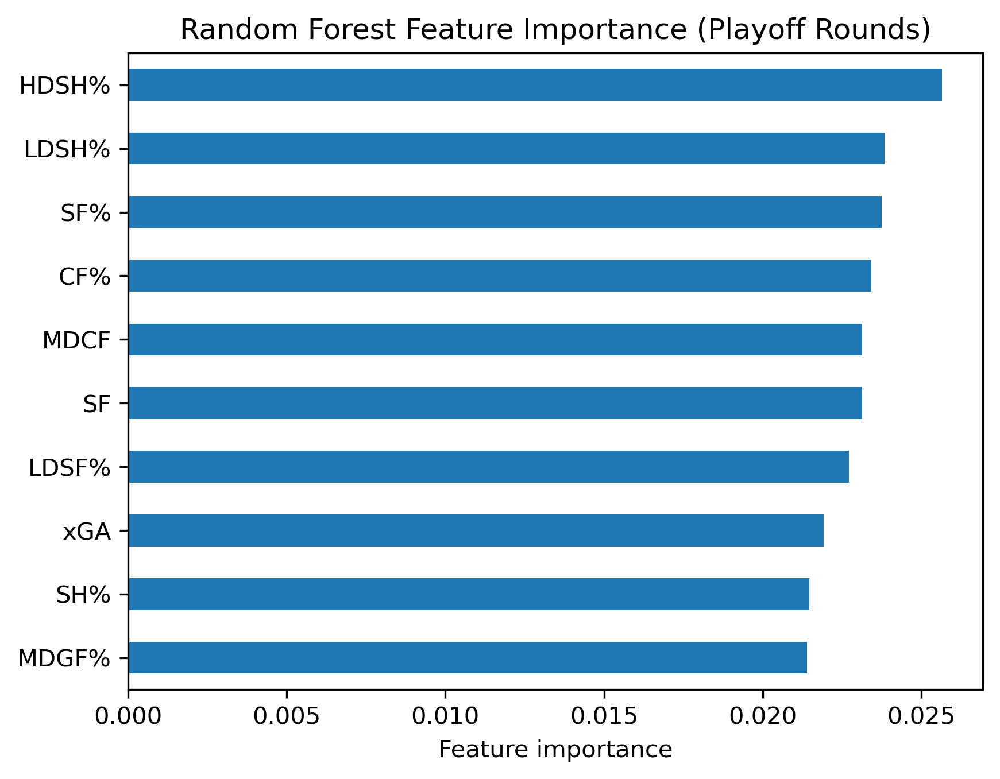

# Can we predict playoff qualification and playoff outcomes based on regular season performance metrics using machine learning?


## Abstract

This project studies whether NHL regular-season performance metrics can be used to predict playoff qualification and playoff success using machine learning. The studie has 2 main parts. The first part predicts wether a team makes the playoffs or not. The second part aims to predict how far the team that was predicted to make the playoffs goes. The dataset combines regular-season team statistics with playoff outcomes across multiple NHL seasons. A time-based training and testing strategy is applied to ensure realistic evaluation and to avoid information leakage.Different machine learning models are trained and compared. The models we use are: Logistic Regression, Random Forest and Support Machine Vector. The results show that playoff qualification can be predicted with reasonable accuracy, while playoff progression is significantly more difficult to predict. This highlights both the strengths and limitations of using regular-season data to model playoff outcomes.

**Keywords:** machine learning, sports analytics, NHL, playoff prediction

\newpage

## Table of Contents

1. Introduction  
2. Literature Review  
3. Methodology  
4. Results  
5. Discussion  
6. Conclusion  
7. References  
8. Appendices  

\newpage


## 1. Introduction

Ice hockey is widely regarded as one of the most unpredictable sports. Games are typically low scoring, and small game-related events can make a big difference in the outcome. Moreover, the fast pace of the game leads to a high degree of randomness. These factors, combined with a high level of parity between NHL teams, make game outcomes unpredictable.

The objective of this project is to analyze whether regular-season performance metrics can be used to predict whether a team will make the playoffs and, if they do, how far they go in the playoffs using different machine learning models. Firstly, using machine learning models, we predict whether teams qualify for the playoffs or not. Secondly, for the teams that do qualify, we aim to predict which rounds they reach in the playoffs.

The analysis is conducted using only team-level regular-season performance metrics and by applying a time-based training and testing split.


## 2.Literature review
Sports analytics has relied more and more  on advanced performance metrics and machine learning techniques to evaluate team strength and predict competitive outcomes. In ice hockey, traditional statistics such as wins and losses are often complemented by advanced metrics. Machine learning models such as Logistic Regression, Random Forest, and Support Vector Machines are often used in sports prediction tasks due to their ability to handle multivariate data and identify patterns in complex datasets. However, predicting playoff outcomes remains challenging. Playoff series involve fewer games, stronger opponents and increased randomness. This project builds on these general approaches by separately modeling playoff qualification and playoff rounds reached using regular-season team statistics. By comparing multiple machine learning models and analyzing feature importance, the project aims to highlight the differences between predicting regular-season success and playoff performance.


## 3.Methodology

### 3.1 Data description
The data used for this project comes from Natural Stat Trick, a public hockey analytics website that provides NHL statistics.

The dataset is structured at a team-season level, meaning that each observation corresponds to a specific team in a specific season. The entire dataset contains ten seasons, and each season has between 30 and 32 teams. The number of teams increased in the 2017/18 season when the Vegas Golden Knights joined the league and again in the 2021/22 season when the Seattle Kraken joined. The 2019/20 and 2020/21 seasons were excluded as they were shortened by the COVID-19 pandemic.

The dataset is composed of regular-season performance metrics as input features such as “Corsi for”, “Corsi against”, “Fenwick for”, “Fenwick against”, “shots for”, “shots against”, and many more. It also includes two target variables derived from playoff outcomes. The first target variable indicates whether a team made the playoffs or not. The second target variable indicates the furthest round the team reached in the playoffs. In total, the dataset is composed of 310 observations and 61 performance metrics.

The data quality is very good, as there are no missing values. Outliers are not removed, as they may represent meaningful differences between teams.

### 3.2 Approach

**Alorithms**
n this project, three supervised machine learning classification algorithms are used: Logistic Regression, Random Forest, and Support Vector Machines. Logistic Regression acts as a baseline model, as it is simple to interpret. Random Forest attempts to capture non-linear interactions between features. Compared to Random Forest, Logistic Regression has difficulty capturing these interactions. Support Vector Machines are included because they can model complex decision boundaries using non-linear methods.

All models are configured to output class probabilities. These probabilities are required because the project relies on ranking teams based on their class probabilities.

**Data cleaning and processing**
The raw data contains separate CSV files for every season, with one containing the regular-season statistics and the other the playoff results. For every season, the regular season and the playoffs are merged. Teams that do not appear in the playoff dataset are assumed to have missed the playoffs.

After merging the dataset, playoff outcomes are transformed into target variables. The playoff rounds reached are transformed into integers, and missing values for teams that missed the playoffs are replaced by 0. Here, 0 indicates that the team missed the playoffs, and 1 indicates that the team made the playoffs.
To prepare the dataset for modeling, several small cleaning steps are applied, such as removing unnamed columns added during data import, standardizing column names, and sorting the dataset by season.

To avoid data leakage, several regular-season summary statistics are removed. These include wins, losses, overtime losses, overtime wins, point percentage, points, goals for, and goals against. These variables are removed because they strongly encode final standings and are not gameplay performance metrics on which the predictions should be based.

Finally, before training the models, non-numeric and non-predictive columns such as team names, season identifiers, and target variables are removed from the feature matrix. The resulting dataset contains only numeric regular-season performance metrics.

Before training the models, the data is scaled because some models, such as SVM and Logistic Regression, are sensitive to differences in feature magnitude. Standardization is applied using only the regular seasons used for training the models. This means that the scaler computes the mean and standard deviation of each feature across every team and training season. Once the scaler is fitted, it is applied to the entire dataset. It is important to note that only input variables are scaled, and not the target variables.

**Model Architecture**
All models are standard implementations from the scikit-learn library. Logistic Regression uses a linear decision boundary with class weighting to avoid class imbalance. Random Forest is an ensemble of decision trees with a finite number of trees in order to address computational costs and balance performance. SVM uses a radial basis function kernel, which allows probability estimation.

The project trains two separate model pipelines. The first predicts whether a team qualifies for the playoffs or not. The second predicts playoff progression using only teams that qualified for the playoffs. For both pipelines, the same dataset is used, but models are trained on different targets. For playoff qualification, teams are ranked by predicted probability, and the top sixteen teams are selected to simulate the playoff cutoff. For playoff rounds reached, the models output class probabilities for each possible playoff round, which are then combined into a ranking score reflecting expected playoff progression. Teams with higher scores are predicted to advance further in the playoffs.

The dataset is split chronologically by season, with the first six seasons used for training and the last four seasons reserved for testing.


**Evaluation Metrics**
Model performance is evaluated using accuracy calculations and confusion matrices. Accuracy is calculated for both playoff qualification and playoff round prediction. Confusion matrices are generated to analyze classification errors, and these are visualized using heatmaps for better interpretability. For playoff rounds, accuracy is also computed separately for each round to understand how prediction performance varies across different rounds of the playoffs.


### 3.3 Implementation

**Langages and Libraries**
The project is implemented in Python using pandas, NumPy, scikit-learn, pathlib, and matplotlib. Pandas is used for data manipulation, data loading, and cleaning. NumPy helps with numerical operations, while matplotlib is used for visualization, such as creating plots and heatmaps. With scikit-learn, machine learning models, visualization utilities, and preprocessing tools are used. Pathlib enables the management of directories and file paths.

**System architecture**
The project is divided into several code sections, with each section having a specific role. This makes the code more readable and ensures reproducibility. The data_loader module cleans the dataset and prepares it for modeling. The models module provides the different model training functions. The evaluation module includes prediction generation, accuracy calculations, confusion matrices, and result formatting. The main script coordinates the full workflow, from data loading and processing to model training, evaluation, visualization, printing, and saving outputs. The outputs are then saved in the results directory.


## 4.Results

### 4.1 Model Comparison
**Playoff Qualification** 
Three models were trained for this project: Logistic Regression, Random Forest, and Support Vector Machine. All three models were trained on the same training seasons and tested on the same testing seasons. Between the three models, we can observe notable differences.

All three models predict playoff qualification with high accuracy, as shown in the accuracy table:

| Model | 2021:2022 | 2022:2023 | 2023:2024 | 2024:2025 |
|---|---:|---:|---:|---:|
| Random Forest | 0.875 | 0.938 | 0.938 | 0.875 |
| Logistic Regression | 0.812 | 0.938 | 0.875 | 0.875 |
| SVM | 0.875 | 0.875 | 0.875 | 0.938 |

*Table: Playoff qualification accuracy by model and season.*

For playoff qualification, Random Forest achieves the strongest accuracy due to the non-linear interactions between regular-season features that it is able to model. Logistic Regression provides slightly lower performance but still very accurate results and serves as a steady baseline, showing that linear relationships already capture most of the signal in the data. SVM also performs very well.

To better understand model behavior beyond accuracy alone, confusion matrices are used to analyze classification errors.

| Actual \ Predicted | Made Playoffs | Missed Playoffs |
|---|---:|---:|
| Made Playoffs | 56 | 8 |
| Missed Playoffs | 8 | 56 |
*Table: Confusion matrix for playoff qualification Logistic Regression*

| Actual \ Predicted | Made Playoffs | Missed Playoffs |
|---|---:|---:|
| Made Playoffs | 58 | 6 |
| Missed Playoffs | 6 | 58 |
*Table: Confusion matrix for playoff qualification Random Forest*

| Actual \ Predicted | Made Playoffs | Missed Playoffs |
|---|---:|---:|
| Made Playoffs | 57 | 7 |
| Missed Playoffs | 7 | 57 |
*Table: Confusion matrix for playoff qualification Support Vector Machine*

Across all models, the confusion matrices are highly symmetric, indicating balanced performance between correctly identifying playoff teams and non-playoff teams. Random Forest produces the fewest misclassifications overall, reinforcing its superior accuracy. Logistic Regression and SVM show slightly higher error counts.


**Playoff Rounds Reached**
Regarding playoff round predictions, there is a steep drop in prediction accuracy for all three models. Predicting playoff progression is much more complicated, as the relative differences between teams making the playoffs are much smaller and outcomes are influenced by additional factors.

| Model | Round 1 | Round 2 | Round 3 | Round 4 | Round 5 |
|---|---:|---:|---:|---:|---:|
| Random Forest | 0.577 | 0.375 | 0.250 | 0.000 | 0.250 |
| Logistic Regression | 0.542 | 0.438 | 0.125 | 0.000 | 0.250 |
| SVM | 0.423 | 0.125 | 0.000 | 0.000 | 0.000 |

*Table: Per-round accuracy for playoff round prediction by model.*

The table shows a clear decline in prediction accuracy as the playoffs progress. All three models perform relatively well in the first round. In the second round, the accuracy of SVM drops significantly, while Logistic Regression and Random Forest still have some predictive power. From rounds 3 to 5, performance deteriorates for all models, and in the case of SVM, it is not capable of correctly predicting any outcome beyond round 2.

\newpage

Confusion matrices further highlight where prediction errors occur:









\newpage

These confusion matrices show that most misclassifications happen between adjacent rounds, particularly between rounds one and two. Later rounds are rarely predicted correctly, especially for SVM. Random Forest demonstrates slightly better diagonal concentration, indicating superior ability to rank playoff teams relative to one another.

Overall, the results demonstrate that machine learning models trained on regular-season data are effective at predicting playoff qualification but do not perform well when trying to predict playoff progression. Random Forest slightly outperforms Logistic Regression and SVM, particularly for playoff qualification and early playoff rounds. However, all models exhibit substantial limitations when predicting deeper playoff outcomes using regular-season data alone.

### 4.2 Feature Importance and Interpretation
Feature importance reveals the differences in variables that influence playoff qualification and playoff progression, as well as the differences between the models.

The Logistic Regression model for playoff qualification gives importance to efficiency and shot-quality metrics to determine whether a team qualifies for the playoffs. Among the most influential positive coefficients are PDO, shooting percentage (SH%), and save percentage (SV%), indicating that teams with strong finishing ability and strong goaltender performance are more likely to reach the playoffs. These variables reflect a team’s ability to convert scoring opportunities while preventing goals, which are key drivers of regular-season success. Low-danger shots for and low-danger goals for also have positive coefficients, meaning that teams that are able to sustain pressure on the opponent, even if they are not high-danger chances, have a higher probability of making the playoffs. On the other hand, generating a high amount of low-danger Corsi for (LDCF) and LDCF% reduces the chances of making the playoffs. This could suggest that teams with a high-volume shooting style have lower probabilities of making the playoffs. Overall, the Logistic Regression model indicates that teams with season-long high efficiency metrics together with good goaltending have a higher probability of qualifying for the post-season. 

\newpage



*Figure: Logistic Regression coefficients for playoff qualification. Positive coefficients indicate features associated with a higher probability of making the playoffs, while negative coefficients indicate the opposite.*

\newpage

For playoff rounds reached, the Logistic Regression model shows a slightly different story. According to the model, defensive exposure and shot suppression metrics are the most important in explaining playoff progression. Features such as expected goals against (xGA), low-danger shots against (LDSA), and low-danger goals against (LDGA) have strong positive coefficients, which may seem counterintuitive, but could indicate that teams advancing further in the playoffs are often those exposed to higher-intensity and defensively challenging games. At the same time, negative coefficients for variables such as medium-danger goal percentage (MDGF%), low-danger Corsi for (LDCF), and total shot attempts against (CA) suggest that teams relying heavily on certain offensive efficiency metrics or allowing high shot volume may struggle to progress further in the playoffs.



*Figure: Logistic Regression coefficients for playoff rounds reached. The coefficients reflect linear relationships between features and playoff progression among playoff teams.*

\newpage

The interpretation of the Random Forest feature scores is less straightforward, as we cannot determine whether a feature increases or reduces the probability of making the playoffs. What can be interpreted, however, is how significant each feature is in reducing classification uncertainty. In other words, the higher the feature score, the more information it provides for classifying teams. For playoff qualification, Random Forest places significant importance on scoring efficiency, shot quality, and goaltending. These features are the most informative for playoff qualification. 



*Figure: Random Forest feature importance for playoff qualification. Higher values indicate features that are more informative for classifying playoff teams.*

\newpage

When examining the playoffs rounds reached, Random forest puts more importance on offence and shooting metrics driven by shot quality, shot volume and high-danger shot percentage. The most important features are high danger shot percentage (HDSH%), low-danger shooting percentage (LDSH%), shot percentage (SF%) and corsi share (CF%). Essentially, the model puts a lot of importance on teams converting their high danger chances while also needing a bit of luck by scoring on low danger chances. Defensive metrics are less important according to the model but are still represented by expected goals against (xGA).



*Figure: Random Forest feature importance for playoff rounds reached. Feature importance reflects relevance rather than direction of effect.*

\newpage

Overall, coefficient and feature analysis highlight the differences between the models and the differences within the models to determine playoff qualification and playoff rounds reached. While the logistic regression emphasizes efficiency-based and goaltending metrics for playoff qualification, playoff progression is more associated with defensive exposure and the ability to perform in high-intensity games. Random Forest, on the other hand, relies more heavily on scoring efficiency and shot quality to determine playoff qualification, and it shifts to shot volume and the ability to score from different shot danger levels.


# 5. discussion

The results of this project show that machine learning models are good at predicting playoff qualifications using regular season data but are limited when predicting playoff success. One of the most successful aspects in this project was separating the target predictions into two tasks. The first one being playoff qualification and the second one playoff rounds reached. This gave us insight on how difficult it is to predict playoff success compared to playoff qualification and which performance metrics are most important in the different stages of the season.

The biggest challenge of this project was finding a meaningful way to classify the playoff rounds reached. Playoff qualification is a binary outcome but playoff progression is ordinal and depends on the tournament's structure. This makes standard classification approaches less suitable, as teams are not simply in a single class but advance through rounds based on relative performance. To address this, the project adopts a two-stage modeling approach. First, teams are ranked based on predicted class probabilities, allowing the selection of the top sixteen teams to simulate the playoff cutoff. Then, for the teams that qualified, the models use class probability outputs to compute an expected playoff progression score, which shows the likelihood of reaching deeper rounds. By ranking teams according to this score and assigning playoff rounds based on their relative order, the approach transforms a complex progression problem into a structured and interpretable prediction task. While the method does not replicate the exact playoff it is a consistent way to evaluate playoff progression.

The results I found exceeded in a way my expectation. I didn't expect the models to predict with this level of accuracy the playoff qualification. Regarding playoff success I knew that predicting the playoff outcomes was a very difficult task and so the models performance was more aligned with my expectations. Logistic Regression performing this well shows that most of the predictive signals come from linear relationships which I did not initially assume.

The project has several important limitations. The first big limitation of the project is the size of the data, especially for playoff rounds as only 16 teams make the playoffs and 6 training seasons which limits the accuracy of the predictions. Secondly, a lot of key information and variables that would make the playoff success predictions more accurate are left out from the data set. This includes matchups, injuries, the conference in which the team finds itself among other relevant variables.

# 6. Conclusion
## 6.1 Summary
The objective of this project was to find out whether regular season performance data would be a good predictor of playoff qualification and playoff success. The result shows that playoff qualification can be predicted with high accuracy using the models such as Logistic Regression, Random Forest and SVM. In contrast, predicting playoff success is much more challenging. The models showed a significant drop in accuracy which highlights the differences between regular season success and playoff success. Overall, the project provided valuable insight into how different machine learning models capture and weigh regular-season performance metrics when predicting NHL playoff outcomes. By comparing linear and non-linear models, the analysis illustrates their limitations in uncertain competitive environments and highlights the complexity of post-season ice hockey.

## 6.2 Future work
For future work, the project could be improved by including more detailed playoff specific information with factors such as team matchups, injuries and recent form could help to get more accurate predictions. In addition, trying with different modeling approaches such as ordinal classification and other more advanced methods could render better results. Lastly, including more seasons for training the various models would help with the accuracy of the predictions.


# 7. References

1. Natural Stat Trick. NHL regular season and playoff team statistics and advanced metrics. Retrieved from https://www.naturalstattrick.com

2. National Hockey League (NHL). Official website and playoff structure: https://www.nhl.com

3. Scikit-learn developers. Scikit-learn: Machine learning in Python: https://scikit-learn.org

4. Python Software Foundation. (2024). Python documentation. https://www.python.org

5. Pandas Documentation. (2024). Pandas documentation. https://pandas.pydata.org

6. NumPy Documentation. (2024). NumPy documentation. https://numpy.org

7. Matplotlib Documentation. (2024). Matplotlib documentation. https://matplotlib.org


# 8. Appendices
## Appendix A

Feature Definitions:

*General Identifiers*
- **season** – NHL season (year)
- **team** – Team name
- **GP** – Games Played
- **TOI** – Total Time on Ice (all situations)

*Corsi (All Shot Attempts)*
- **CF** – Corsi For (shot attempts for)
- **CA** – Corsi Against (shot attempts against)
- **CF%** – Corsi For Percentage (CF / (CF + CA))

*Fenwick (Unblocked Shot Attempts)*
- **FF** – Fenwick For
- **FA** – Fenwick Against
- **FF%** – Fenwick For Percentage

*Shots on Goal*
- **SF** – Shots For
- **SA** – Shots Against
- **SF%** – Shots For Percentage

*Expected Goals*
- **xGF** – Expected Goals For
- **xGA** – Expected Goals Against
- **xGF%** – Expected Goals For Percentage

*Scoring Chances (All)*
- **SCF** – Scoring Chances For
- **SCA** – Scoring Chances Against
- **SCF%** – Scoring Chances For Percentage

*Scoring Chance Shots*
- **SCSF** – Scoring Chance Shots For
- **SCSA** – Scoring Chance Shots Against
- **SCSF%** – Scoring Chance Shot Percentage

*Scoring Chance Goals*
- **SCGF** – Scoring Chance Goals For
- **SCGA** – Scoring Chance Goals Against
- **SCGF%** – Scoring Chance Goal Percentage
- **SCSH%** – Scoring Chance Shooting Percentage
- **SCSV%** – Scoring Chance Save Percentage

*High-Danger Chances*
- **HDCF** – High-Danger Chances For
- **HDCA** – High-Danger Chances Against
- **HDCF%** – High-Danger Chance Percentage

*High-Danger Shots*
- **HDSF** – High-Danger Shots For
- **HDSA** – High-Danger Shots Against
- **HDSF%** – High-Danger Shot Percentage

*High-Danger Goals*
- **HDGF** – High-Danger Goals For
- **HDGA** – High-Danger Goals Against
- **HDGF%** – High-Danger Goal Percentage
- **HDSH%** – High-Danger Shooting Percentage
- **HDSV%** – High-Danger Save Percentage

*Medium-Danger Chances*
- **MDCF** – Medium-Danger Chances For
- **MDCA** – Medium-Danger Chances Against
- **MDCF%** – Medium-Danger Chance Percentage

*Medium-Danger Shots*
- **MDSF** – Medium-Danger Shots For
- **MDSA** – Medium-Danger Shots Against
- **MDSF%** – Medium-Danger Shot Percentage

*Medium-Danger Goals*
- **MDGF** – Medium-Danger Goals For
- **MDGA** – Medium-Danger Goals Against
- **MDGF%** – Medium-Danger Goal Percentage
- **MDSH%** – Medium-Danger Shooting Percentage
- **MDSV%** – Medium-Danger Save Percentage

*Low-Danger Chances*
- **LDCF** – Low-Danger Chances For
- **LDCA** – Low-Danger Chances Against
- **LDCF%** – Low-Danger Chance Percentage

*Low-Danger Shots*
- **LDSF** – Low-Danger Shots For
- **LDSA** – Low-Danger Shots Against
- **LDSF%** – Low-Danger Shot Percentage

*Low-Danger Goals*
- **LDGF** – Low-Danger Goals For
- **LDGA** – Low-Danger Goals Against
- **LDGF%** – Low-Danger Goal Percentage
- **LDSH%** – Low-Danger Shooting Percentage
- **LDSV%** – Low-Danger Save Percentage

*Goaltending & Luck Metrics*
- **SH%** – Team Shooting Percentage
- **SV%** – Team Save Percentage
- **PDO** – Shooting Percentage + Save Percentage (luck indicator)

*Target Variables*
- **made_playoffs** – Playoff qualification (1 = yes, 0 = no)
- **round_reached** – Furthest playoff round reached


- Figures:

Heatmaps – Playoff Rounds Reached


Logistic Regression Coefficients


Random Forest Feature Importance


- Tables:

Accuracy Results
- Playoff qualification accuracy: `results/playoff_accuracy.csv`
- Playoff round prediction accuracy: `results/round_accuracy.csv`
- Per-round accuracy breakdown: `results/per_round_accuracy.csv`


Confusion Matrices – Playoff Qualification
- Logistic Regression: `results/playoff_confusion_matrix_Logistic Regression.csv`
- Random Forest: `results/playoff_confusion_matrix_Random Forest.csv`
- Support Vector Machine: `results/playoff_confusion_matrix_SVM.csv`


Confusion Matrices – Playoff Rounds Reached
- Logistic Regression: `results/round_confusion_matrix_Logistic Regression.csv`
- Random Forest: `results/round_confusion_matrix_Random Forest.csv`
- Support Vector Machine: `results/round_confusion_matrix_SVM.csv`


Top Feature and Coefficient Tables
- Logistic Regression – Top 10 coefficients (playoffs):  
  `results/logistic_regression_top10_coefficients_playoffs.csv`

- Logistic Regression – Top 10 coefficients (rounds):  
  `results/logistic_regression_top10_coefficients_rounds.csv`

- Random Forest – Top 10 features (playoffs):  
  `results/random_forest_top10_features_playoffs.csv`

- Random Forest – Top 10 features (rounds):  
  `results/random_forest_top10_features_rounds.csv`

## Appendix B
Code Repository

**GitHub Repository:** https://github.com/elias1285/NHL-Data-project-ELIAS-WIJKSTROM

### Repository Structure

NHL-Data-project-ELIAS-WIJKSTROM/
├── data/
│   ├── clean/
│   │   └── all_seasons_clean.csv
│   └── raw/
├── notebooks/
│   └── EDA.ipynb
├── results/
├── src/
│   ├── data_loader.py
│   ├── evaluation.py
│   └── models.py
├── environment.yml
├── main.py
├── project_report.md
└── README.md


### Installation Instructions

```bash
git clone https://github.com/elias1285/NHL-Data-project-ELIAS-WIJKSTROM.git
cd NHL-Data-project-ELIAS-WIJKSTROM
conda env create -f environment.yml
conda activate NHL-Data-project

```

### run the project

``bash
python main.py 
``

### PDF conversion
To convert this Markdown file to PDF, use pandoc:

```bash
pandoc project_report.md -o project_report.pdf --pdf-engine=xelatex
```